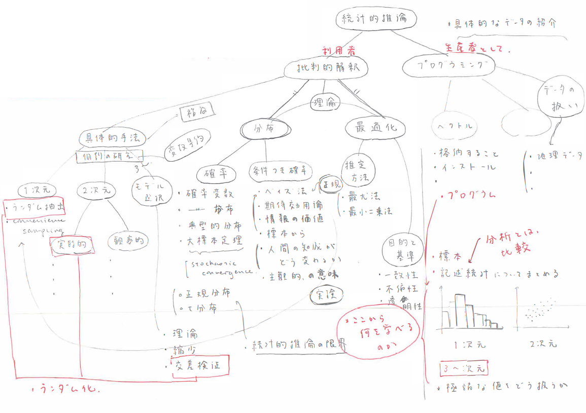

# 目指すもの {-}

データ保存・計算の飛躍的な技術革新を背景とし、データ分析を体系的に理解・実践する知識・技能の社会的意義が高まっている。本講義「ミクロ・データサイエンス」は、以下の二つのことを目的としている。

(1) 社会経済の理解の基盤となるデータ分析について、批判的に吟味できること (すなわち、結論を無批判・無反省に受け入れるのではなく、その仮定に気づき吟味できること)

(2) 日進月歩のプログラミング環境の中でも、その根本にある基礎概念は普遍的である。実際に経験することでそれらを学び、プログラミングをこれから独立して学び続けていくための知識・技能を体得すること

**講義内容全体のマインドマップ:** 

**どう学ぶか**

講義ビデオを確認できるため、ノートを自分で取ることの意義を見出しづらいかもしれない。しかし、本講義で用いている数式を理解するため、こつこつ自分の手でノートを取って考えて行こう。

- 講義ビデオが長くなってしまうときについては、目次において、特に重要なビデオに*をつけて強調している
- 講義では、自分でも気づかず「言い間違い」をしてしまうことがある。「あれ？」と思ったら、連絡をしてほしい

*講義内容は、「歴史」や「雑談」の要素を大切にしています。これらについては、暗記をする必要はありません。